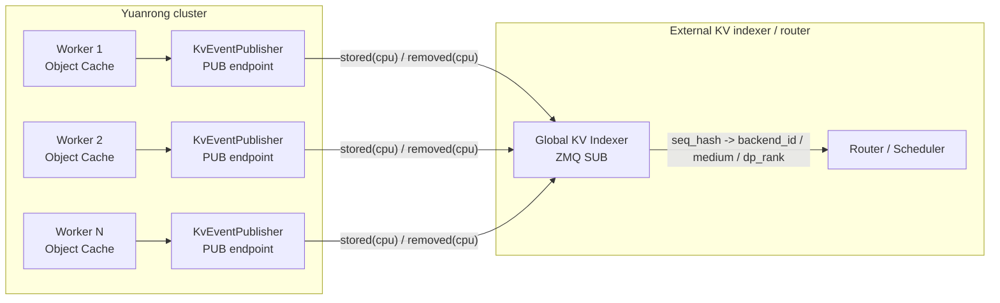

# Yuanrong KvEventPublisher 事件需求设计文档

## 1. 背景

Yuanrong Datasystem 作为 KV cache 后端时，外部全局 KV indexer 需要感知每个 worker 上 KV block 的可用状态。worker 在本地 CPU 内存中新增、删除或释放 KV block 后，应向 indexer 发布事件，indexer 根据事件维护全局索引，并为后续 KV cache 命中、路由和调度提供依据。

本设计在 Yuanrong worker object cache 模块中新增可选的 `KvEventPublisher` 能力。该能力通过 ZMQ PUB 发布 MessagePack 编码的 KV 事件，向外部 indexer 通知 CPU 介质上的 `stored` 和 `removed` 状态变化。

## 2. 现状与问题

Yuanrong worker 已经具备 object table、CPU 内存对象生命周期、Delete/Clear、eviction 等能力，但这些状态变化目前只存在于 worker 内部。外部 indexer 无法直接知道：

- 某个 KV block 何时已经在某个 worker 的 CPU 内存中可读。
- 某个 KV block 何时已经从某个 worker 的 CPU 内存中删除或释放。
- 某个 worker 上的 CPU 副本是否仍可用于后续 KV cache 命中。

因此需要在 worker 状态变化成功后发布增量事件。事件只表达当前 worker、当前 medium 上的状态变化，不表达其他 worker 或其他介质的状态。

## 3. 目标

实现 worker 侧可选开启的 `KvEventPublisher`，满足以下目标：

1. 支持通过单个 JSON 字符串配置开启或关闭。
2. 支持 ZMQ PUB 三帧消息格式。
3. 支持 MessagePack payload，payload 中包含一批事件。
4. 支持 `stored(cpu)` 事件，表示 KV block 已在本 worker CPU 内存中可用。
5. 支持 `removed(cpu)` 事件，表示 KV block 已从本 worker CPU 内存中不可用。
6. 事件发布使用 best-effort 语义，不影响原业务请求结果。
7. 业务热路径只做轻量入队，不做 key 解析、MessagePack 编码或 ZMQ IO。
8. key 无法解析为 `seq_hash` 时跳过事件并计数，不影响业务请求。
9. 默认关闭，关闭时不改变现有 worker 行为。

## 4. 非目标

以下内容不在本设计范围内：

- `stored(disk)` / `removed(disk)`。
- L2 persistence、write-through、write-back、spill 文件、shared disk 等 disk 介质事件。
- spill 成功后的 `stored(disk)` + `removed(cpu)` 组合事件。
- metadata recovery、migrate、scale-down 等恢复或迁移场景补发事件。
- 启动时扫描已有对象并发布 snapshot。
- replay endpoint 或可靠投递确认机制。
- HTTP 管理接口。
- 新增全局事件总线、额外线程池或额外第三方依赖。
- `cleared` 事件。

## 5. 部署视图

每个 Yuanrong worker 独立启动一个 `KvEventPublisher`，并绑定一个独立的 ZMQ PUB endpoint。外部 indexer 连接所有 worker 的 PUB endpoint，接收 `stored(cpu)` 和 `removed(cpu)` 事件并维护全局索引。



部署约束：

- 每个 worker 的 `bind_endpoint` 不能冲突。
- 每个 worker 的 `backend_id` 应能被外部 indexer/router 识别，并能定位到对应 worker。
- `model_name`、`block_size`、`additional_salt`、`lora_name`、`tenant_id`、`dp_rank` 需要与推理引擎侧 hash 语义保持一致。
- ZMQ PUB/SUB 没有 per-event ack，indexer 晚启动、断连或 publisher 队列满都可能导致 indexer 状态不完整。

## 6. 配置设计

只新增一个 worker gflag：

```cpp
DS_DEFINE_string(kv_events_config, "", "KV event publisher JSON config. Empty means disabled.");
```

语义：

- `kv_events_config == ""`：关闭 `KvEventPublisher`。
- `kv_events_config != ""`：按 JSON object 解析配置。
- 配置解析失败、必填字段缺失或非法时，publisher 保持关闭，worker 继续启动。

最小配置：

```json
{
  "bind_endpoint": "tcp://0.0.0.0:5557",
  "backend_id": "worker-0"
}
```

完整配置：

```json
{
  "bind_endpoint": "tcp://0.0.0.0:5557",
  "backend_id": "worker-0",
  "tenant_id": "default",
  "model_name": "",
  "additional_salt": "",
  "lora_name": "",
  "block_size": 0,
  "dp_rank": 0,
  "emit_legacy_compat_fields": true,
  "queue_capacity": 65536
}
```

字段说明：

| JSON 字段 | 必选 | 默认值 | 说明 |
| --- | --- | --- | --- |
| `bind_endpoint` | 是 | 无 | ZMQ PUB 绑定地址，例如 `tcp://0.0.0.0:5557` |
| `backend_id` | 是 | 无 | 当前 worker 的后端标识 |
| `tenant_id` | 否 | `"default"` | object key 中无法解析 tenant 时使用 |
| `model_name` | 否 | `""` | 空字符串编码为 `null` |
| `additional_salt` | 否 | `""` | 空字符串编码为 `null` |
| `lora_name` | 否 | `""` | 空字符串编码为 `null` |
| `block_size` | 否 | `0` | `0` 编码为 `null` |
| `dp_rank` | 否 | `0` | data parallel rank |
| `emit_legacy_compat_fields` | 否 | `true` | 是否输出兼容字段 |
| `queue_capacity` | 否 | `65536` | 内部有界队列容量，必须大于 0 |

兼容字段开关：

- `emit_legacy_compat_fields=true` 时额外输出 `type`、`block_hashes`、`parent_block_hash`。
- `emit_legacy_compat_fields=false` 时只输出标准字段。
- 该开关不影响 publisher 是否启动，不影响 ZMQ 帧格式，不影响标准 `stored` / `removed` 字段。

### 6.1 使用示例

使用 `dscli start` 启动 worker，并开启 publisher：

```bash
dscli start -w \
  --worker_address "127.0.0.1:31501" \
  --etcd_address "127.0.0.1:12379" \
  --v 1 \
  --kv_events_config '{"bind_endpoint":"tcp://0.0.0.0:5557","backend_id":"worker-0","tenant_id":"default","dp_rank":0}'
```

说明：

- `--v 1` 用于打开 `VLOG(1)`，方便在 worker 日志中看到成功发布的 payload。
- `bind_endpoint` 是 worker 侧 ZMQ PUB bind 地址。
- 订阅方连接时应使用可访问 worker 的地址，例如 `tcp://127.0.0.1:5557` 或 `tcp://<worker-ip>:5557`。
- `backend_id` 应与外部 indexer/router 中识别该 worker 的标识一致。

启动成功时，worker 日志应出现：

```text
KV event publisher started at tcp://0.0.0.0:5557
```

## 7. 事件协议

### 7.1 ZMQ 三帧格式

每个 batch 作为一条 ZMQ multipart message 发送，包含三帧：

```text
frame 1: empty topic
frame 2: big-endian uint64 publisher sequence
frame 3: msgpack payload: [timestamp_ms, [events...], dp_rank]
```

说明：

- frame 1 是长度为 0 的空 topic，占位用于 PUB/SUB topic 语义。
- frame 2 是 publisher batch 序号，按当前 publisher stream 单调递增。
- frame 3 是 MessagePack payload，解码后是 `[timestamp_ms, [events...], dp_rank]`。
- `stored` 和 `removed` 不是独立 frame，而是 frame 3 中 `events` 数组里的 object。
- 一个 batch 可以包含多个 event。

示例

```json
[
  1770000000000,
  [
    {
      "event_id": 1,
      "timestamp": 1770000000000,
      "event_type": "stored",
      "type": "BlockStored",
      "tenant_id": "default",
      "backend_id": "worker-0",
      "medium": "cpu",
      "dp_rank": 0,
      "seq_hashes": [42],
      "block_hashes": [42],
      "base_block_idx": null,
      "parent_hash": null,
      "token_ids": null,
      "parent_block_hash": null
    }
  ],
  0
]
```

### 7.2 公共字段

`stored` 和 `removed` 共享以下字段：

| 字段 | 含义 |
| --- | --- |
| `event_id` | event 级序号，按 publisher stream 单调递增 |
| `timestamp` | event 打包时间，Unix epoch 毫秒 |
| `event_type` | `stored` 或 `removed` |
| `model_name` | 配置中的模型名；空值编码为 `null` |
| `block_size` | 配置中的 block size；0 编码为 `null` |
| `additional_salt` | 配置中的额外 salt；空值编码为 `null` |
| `lora_name` | 配置中的 LoRA 名；空值编码为 `null` |
| `tenant_id` | 从 object key 解析，失败时使用配置默认值"default" |
| `backend_id` | 配置中的 worker 后端标识 |
| `medium` | 当前只发布 `cpu` |
| `dp_rank` | 配置中的 data parallel rank |
| `seq_hashes` | 从object_key解析得到的 `seq_hash` |
| `base_block_idx` | 固定值 `null` |

### 7.3 stored(cpu)

`stored(cpu)` 表示某个 KV block 已经在当前 worker 的 CPU 内存中可读。

示例：

```json
{
  "event_id": 1,
  "timestamp": 1770000000000,
  "event_type": "stored",
  "type": "BlockStored",
  "model_name": null,
  "block_size": null,
  "additional_salt": null,
  "lora_name": null,
  "tenant_id": "default",
  "backend_id": "worker-0",
  "medium": "cpu",
  "dp_rank": 0,
  "seq_hashes": [42],
  "block_hashes": [42],
  "base_block_idx": null,
  "parent_hash": null,
  "token_ids": null,
  "parent_block_hash": null
}
```

`stored(cpu)` 专有字段：

| 字段 | 取值 |
| --- | --- |
| `event_type` | `"stored"` |
| `type` | `"BlockStored"`，仅兼容字段开启时输出 |
| `parent_hash` | 固定值，编码为 `null` |
| `token_ids` | 固定值，编码为 `null` |
| `parent_block_hash` | 固定值，兼容字段开启时编码为 `null` |

### 7.4 removed(cpu)

`removed(cpu)` 表示某个 KV block 已经从当前 worker 的 CPU 内存中不可用。

示例：

```json
{
  "event_id": 2,
  "timestamp": 1770000000000,
  "event_type": "removed",
  "type": "BlockRemoved",
  "model_name": null,
  "block_size": null,
  "additional_salt": null,
  "lora_name": null,
  "tenant_id": "default",
  "backend_id": "worker-0",
  "medium": "cpu",
  "dp_rank": 0,
  "seq_hashes": [42],
  "block_hashes": [42],
  "base_block_idx": null
}
```

`removed(cpu)` 专有字段：

| 字段 | 取值 |
| --- | --- |
| `event_type` | `"removed"` |
| `type` | `"BlockRemoved"`，仅兼容字段开启时输出 |

`removed(cpu)` 只表示当前 worker 的 CPU 副本不可用，不表示其他 worker、disk、L2 或其他介质不可用。

## 8. 模块设计

新增模块：

```text
src/datasystem/worker/object_cache/kv_event/
  kv_event_config.h
  kv_event_publisher.h
  kv_event_publisher.cpp
```

核心组件：

| 组件 | 职责 |
| --- | --- |
| `KvEventConfig` | 保存配置开关、endpoint、身份字段、队列容量和兼容字段开关 |
| `KvEventPublisher` | 对外提供 `PublishStored()` / `PublishRemoved()`，内部异步打包并发送事件 |
| `Stats` | 记录发布、丢弃、跳过等统计 |
| key parser | 从 Yuanrong object key 中解析 tenant、真实 key 和 `seq_hash` |

对外接口：

```cpp
class KvEventPublisher {
public:
    explicit KvEventPublisher(KvEventConfig config);
    ~KvEventPublisher();

    bool Enabled() const;

    void PublishStored(const std::string &objectKey, const std::string &medium);
    void PublishRemoved(const std::string &objectKey, const std::string &medium);

    Stats GetStats() const;
};
```

约束：

- `PublishStored()` / `PublishRemoved()` 是 fire-and-forget，不返回业务错误。
- publisher disabled 时接口直接返回。
- 初始化失败时记录日志并保持 disabled。
- 业务线程只入队，不负责编码和发送。
- ZMQ socket 只由后台线程访问。

## 9. 内部队列与后台线程

内部队列使用有界队列：

```cpp
mutable std::mutex queueMutex_;
std::deque<PendingEvent> queue_;
std::condition_variable queueCv_;
std::atomic<bool> stop_{false};
```

入队规则：

1. 业务线程调用 `PublishStored()` 或 `PublishRemoved()`。
2. 如果 publisher 未启用，直接返回。
3. 构造轻量 `PendingEvent`。
4. 持有 `queueMutex_`，检查队列容量。
5. 队列未满则 `push_back()` 并通知后台线程。
6. 队列已满则丢弃当前事件，`droppedEvents` 加一。

后台线程流程：

1. 等待队列非空或停止信号。
2. 从队列中批量取出最多 `kMaxBatchSize` 个 `PendingEvent`。
3. 释放 `queueMutex_`。
4. 对每个 pending event 解析 key。
5. key 解析失败时跳过事件，`skippedUnparsedKeys` 加一。
6. 构造 `stored` 或 `removed` event object。
7. 构造 payload `[timestamp_ms, [events...], dp_rank]`。
8. 使用 MessagePack 编码 payload。
9. 发送 ZMQ 三帧。
10. 成功后更新 `publishedBatches` 和 `publishedEvents`。

性能约束：

- 不在业务线程做 MessagePack 编码。
- 不在业务线程做 ZMQ send。
- 不等待 ZMQ consumer。
- 不等待队列空间。
- 队列锁只保护 `queue_` 的 push/pop。
- key 解析、event 构造、编码和发送都在释放队列锁后执行。

## 10. Key 解析

输入是 worker object table 中看到的 `objectKey`。输出结构：

```cpp
struct ParsedKey {
    std::string tenantId;
    std::string realObjectKey;
    uint64_t seqHash;
};
```

解析流程：

1. 使用 Yuanrong tenant 工具从 `objectKey` 中提取 tenant。
2. 如果无法提取 tenant，使用配置中的 `tenant_id`。
3. 提取真实 object key。
4. 如果真实 key 末尾匹配 `__` + 16 位十六进制字符，先去掉该后缀。
5. 从真实 key 中提取候选 hash 字符串。
6. 将候选 hash 解析为 `uint64_t seqHash`。
7. 解析失败时返回空，事件跳过。

候选 hash 提取规则：

| key 形态 | 候选值 |
| --- | --- |
| 纯十进制，例如 `12345` | 整个 key |
| `0x` / `0X` 前缀十六进制，例如 `0x2a` | 整个 key |
| 带 tenant namespace，例如 `tenant-a$0x2a` | 去掉 tenant 后的真实 key |
| PoolKey 字符串，最后一个字段是 block hash | 最后一个 `@` 后的字段 |
| LayerPoolKey 字符串，倒数第二个字段是 block hash | 倒数第二个 `@` 后的字段 |

解析示例：

| 输入 object key | 解析结果 |
| --- | --- |
| `12345` | tenant=`default`，`seqHash=12345` |
| `tenant-a$12345` | tenant=`tenant-a`，`seqHash=12345` |
| `tenant-a$0x2a` | tenant=`tenant-a`，`seqHash=42` |
| `tenant-a$model@pcp0@dcp0@head_or_tp_rank:0@pp_rank:0@group:0@cache_role:kv@cache_family:default@0x75bcd15` | tenant=`tenant-a`，`seqHash=123456789` |
| `tenant-a$model@pcp0@dcp0@head_or_tp_rank:0@group:0@cache_role:kv@cache_family:default@0x75bcd15@17` | tenant=`tenant-a`，`seqHash=123456789` |
| `tenant-a$model@pcp0@dcp0@head_or_tp_rank:0@pp_rank:0@group:0@cache_role:kv@cache_family:default@0x2a__0123456789abcdef` | tenant=`tenant-a`，去掉 suffix 后 `seqHash=42` |
| `tenant-a$not-a-hash` | 解析失败，跳过事件 |

注意：

- `seqHash=0` 是合法值。
- 超过 `uint64_t` 范围的值解析失败。
- 如果 key 被截断导致 block hash 丢失，无法可靠恢复 `seq_hash`，事件跳过。
- key 解析失败不影响原业务请求结果。

## 11. 生命周期接入

### 11.1 publisher 创建与传递

`WorkerOCServiceImpl` 在 worker 初始化时读取 `FLAGS_kv_events_config`：

1. 调用 `BuildKvEventConfigFromJsonString()`。
2. 如果配置启用，则创建 `std::shared_ptr<KvEventPublisher>`。
3. 如果 publisher 初始化失败，则释放指针，worker 继续运行。
4. 将 publisher 指针传递给 object cache 相关组件。
5. eviction manager 使用 `std::weak_ptr<KvEventPublisher>` 保存引用，避免反向延长 publisher 生命周期。

### 11.2 stored(cpu)

当前 `stored(cpu)` 只在 `MSetD2H` 写入 CPU 内存成功后发布。该路径最终进入 multi publish 更新本地 object 状态。

触发位置：

```text
src/datasystem/worker/object_cache/service/worker_oc_service_multi_publish_impl.cpp
WorkerOcServiceMultiPublishImpl::UpdateObjectAfterCreatingMeta()
```

发布时机：

- 单个 object 的本地状态已经更新完成。
- `SetCacheInvalid(false)` 已完成，表示本 worker CPU 内存副本可读。
- 必要的收尾逻辑完成后，调用 `PublishStored(objectKey, "cpu")`。

不在普通 `PublishObject()` 路径发布 `stored(cpu)`，避免非目标路径产生事件。

### 11.3 removed(cpu) by Delete/Clear

用户删除或 worker 接收到删除通知后，最终会走 object table 清理逻辑。

触发位置：

```text
src/datasystem/worker/object_cache/service/worker_oc_service_crud_common_api.cpp
WorkerOcServiceCrudCommonApi::ClearObject()
```

发布时机：

- erase 前记录该对象是否有可读 CPU 副本。
- `objectTable_->Erase(objectKey, entry)` 成功后。
- 如果 erase 前对象存在且 `CacheInvalid=false`，调用 `PublishRemoved(objectKey, "cpu")`。

判断方法：

```cpp
const bool hadCpuCopy = entry.Get() != nullptr && !entry->stateInfo.IsCacheInvalid();
```

约束：

- `objectTable_->Erase()` 失败时不发布。
- 对象原本没有可读 CPU 副本时不发布。
- 不在调用 `ClearObject()` 的上层路径重复发布。

### 11.4 removed(cpu) by Eviction

eviction 释放或删除 CPU 内存副本后，需要发布 `removed(cpu)`。

触发位置：

```text
src/datasystem/worker/object_cache/worker_oc_eviction_manager.cpp
WorkerOcEvictionManager::EvictObject()
```

处理 action：

| Action | 事件 | 发布时机 |
| --- | --- | --- |
| `DELETE` | `removed(cpu)` | `objectTable_->Erase()` 成功后 |
| `FREE_MEMORY` | `removed(cpu)` | `entry->FreeResources()` 成功后 |

约束：

- 发布前先判断对象是否曾有可读 CPU 副本。
- `SPILL`、`MIGRATE`、`END_LIFE`、`RETAIN`、`UNKNOWN` 不在本设计中发布事件。
- `removed(cpu)` 不表示 disk/L2 副本不可用。

## 12. 去重与漏发控制

采用“状态成功后的单点发布”降低重复事件：

| 事件 | 发布单点 |
| --- | --- |
| `stored(cpu)` | `UpdateObjectAfterCreatingMeta()` 中单个 key 状态更新完成后 |
| `removed(cpu)` by Delete/Clear | `ClearObject()` erase 成功后 |
| `removed(cpu)` by Eviction DELETE | `EvictObject()` erase 成功后 |
| `removed(cpu)` by Eviction FREE_MEMORY | `EvictObject()` free 成功后 |

不重复发布的位置：

- 不在 `DeleteAllCopyWithLock()` 或删除通知入口重复发布。
- 不在 `WorkerOcServiceClearDataFlow` 重复发布。
- 不在 `evictionManager_->Erase()` 发布。
- 不在普通 `PublishObject()` 发布 `stored(cpu)`。

事件是 best-effort 通知。如果 publisher 关闭、队列满、key 解析失败或 ZMQ send 失败，业务请求仍按原逻辑返回。

## 13. 错误处理与可观测性

统计字段：

| 字段 | 含义 |
| --- | --- |
| `publishedBatches` | 成功发送的 batch 数 |
| `publishedEvents` | 成功发送的 event 数 |
| `droppedEvents` | 队列满丢弃的 event 数 |
| `skippedUnparsedKeys` | key 解析失败跳过的 event 数 |

错误处理：

- 配置为空：publisher disabled。
- 配置解析失败：记录 ERROR，publisher disabled。
- 缺少 `bind_endpoint` 或 `backend_id`：记录 ERROR，publisher disabled。
- `queue_capacity=0`：记录 ERROR，publisher disabled。
- ZMQ 初始化或 bind 失败：记录 ERROR，publisher disabled，worker 继续启动。
- 队列满：丢弃新事件，业务不失败。
- key 解析失败：跳过事件，业务不失败。
- MessagePack 编码失败：丢弃当前 batch，后台线程继续处理后续 batch。
- ZMQ send 失败：当前 batch 不重试，后台线程继续处理后续 batch。

日志策略：

- publisher 启动和关闭打印 INFO。
- 配置错误、初始化失败打印 ERROR。
- send 失败、编码失败按限频输出日志。
- key 解析失败按限频输出日志，避免日志风暴和暴露大量用户 key。
- 成功发送可使用 VLOG 打印 event count、sequence、payload size 和调试 payload。

建议日志与排查方式：

| 场景 | 日志级别 | 关键日志 | 用途 |
| --- | --- | --- | --- |
| publisher 未配置 | 无固定日志 | `kv_events_config` 为空时不创建 publisher | 默认关闭场景，不应看到启动日志 |
| 配置 JSON 解析失败 | ERROR | `Failed to parse kv_events_config` | 判断配置字符串不是合法 JSON |
| 配置不是 JSON object | ERROR | `kv_events_config must be a JSON object` | 判断配置类型错误 |
| 配置字段类型错误 | ERROR | `Invalid kv_events_config field type` | 判断字段类型不符合预期 |
| 缺少 endpoint | ERROR | `kv_events_config.bind_endpoint is required` | 判断 `bind_endpoint` 未配置 |
| 缺少 backend id | ERROR | `kv_events_config.backend_id is required` | 判断 `backend_id` 未配置 |
| 队列容量非法 | ERROR | `kv_events_config.queue_capacity must be greater than 0` | 判断 `queue_capacity=0` |
| publisher 配置非法 | ERROR | `KV event publisher config is invalid` | 判断构造时发现配置不可用 |
| ZMQ context 初始化失败 | ERROR | `Failed to init KV event ZMQ context` | 判断 ZMQ context 初始化失败 |
| PUB socket 创建失败 | ERROR | `Failed to create KV event PUB socket` | 判断 socket 创建失败 |
| socket option 设置失败 | ERROR | `Failed to set KV event PUB linger` | 判断 socket option 设置失败 |
| endpoint bind 失败 | ERROR | `Failed to bind KV event PUB endpoint` | 判断端口占用、地址非法或权限问题 |
| publisher 启动成功 | INFO | `KV event publisher started at <bind_endpoint>` | 判断 publisher 已启用并完成 bind |
| MessagePack 编码失败 | ERROR | `Failed to encode KV event payload` | 判断 batch 编码失败 |
| ZMQ send 失败 | ERROR | `Failed to send KV event batch` | 判断三帧发送失败 |
| event batch 发送成功 | VLOG(1) | `Published KV event batch, sequence: ..., event count: ..., payload bytes: ..., payload: ...` | 判断确实发布了事件，并查看 payload 内容 |

启动判断：

- 如果配置非空且合法，worker 日志中应出现：

```text
KV event publisher started at <bind_endpoint>
```

- 如果配置非空但没有看到该日志，应优先搜索 `kv_events_config`、`KV event publisher`、`Failed to bind KV event PUB endpoint` 等关键字。
- 如果通过 `dscli` 启动，日志通常在 `dscli` 输出的 log directory 下，例如 `datasystem/logs`。

发布判断：

- 发布成功日志使用 `VLOG(1)`，需要启动 worker 时设置 `-v=1` 或等价日志级别。
- 看到以下日志即可判断 publisher 后台线程已经成功发送了一个 batch：

```text
Published KV event batch, sequence: 1, event count: 2, payload bytes: ..., payload: [...]
```

- `event count` 表示本 batch 中有效 event 数。
- `payload` 是 MessagePack 编码前的 JSON 结构，便于直接确认 `event_type`、`medium`、`seq_hashes`、`backend_id`、`dp_rank` 等字段。
- 如果业务成功但没有发布成功日志，应检查：
  - `kv_events_config` 是否为空或解析失败。
  - 是否看到 publisher 启动成功日志。
  - key 是否能解析为 `seq_hash`。
  - 是否命中了当前设计覆盖的生命周期路径。
  - 是否发生队列满、编码失败或 send 失败。

队列满与 key 解析失败：

- 队列满和 key 解析失败必须更新 `GetStats()` 中的 `droppedEvents`、`skippedUnparsedKeys`。
- 为避免日志风暴，逐条 drop 和逐条 key 解析失败不建议默认打印 ERROR。
- 如需现场定位，可增加限频 WARNING 或 VLOG 日志，内容应避免输出完整用户 key，可只输出截断 key、event 类型和当前统计值。

## 14. 测试设计

### 14.1 单元测试

覆盖：

- 配置解析：
  - 空字符串 disabled。
  - 最小配置 enabled。
  - 可选字段默认值。
  - `emit_legacy_compat_fields` 默认为 true。
  - `emit_legacy_compat_fields=false` 时不输出兼容字段。
  - 非法 JSON disabled。
  - 缺少 `bind_endpoint` disabled。
  - 缺少 `backend_id` disabled。
  - `queue_capacity=0` disabled。
- key parser：
  - 十进制 key。
  - 十六进制 key。
  - tenant namespace。
  - PoolKey。
  - LayerPoolKey。
  - normalize suffix。
  - invalid key。
  - empty key。
  - overflow key。
- publisher：
  - disabled no-op。
  - stored payload 字段。
  - removed payload 字段。
  - 多 event batch。
  - 队列满 drop。
  - 非法 key skip。

### 14.2 系统测试

使用真实 worker + ZMQ SUB：

1. 启动 worker，设置非空 `kv_events_config`。
2. 测试进程连接 `bind_endpoint`。
3. 通过 `MSetD2H` 写入可解析 key。
4. 验证收到 `stored(cpu)`：

```text
event_type = stored
medium = cpu
seq_hashes = [parsed_key]
backend_id = configured backend_id
```

5. 删除同一批 key。
6. 验证收到 `removed(cpu)`：

```text
event_type = removed
medium = cpu
seq_hashes = [parsed_key]
backend_id = configured backend_id
```

7. 触发 eviction 删除或释放 CPU 内存副本。
8. 验证收到 `removed(cpu)`。

### 14.3 性能验证

覆盖：

- `kv_events_config=""` 与启用 publisher 时 `MSetD2H`、Delete、eviction 的延迟对比。
- 慢 subscriber 或无 subscriber 场景下业务请求不被 ZMQ consumer 拖慢。
- 队列满场景下业务请求不等待队列空间。
- 确认业务线程没有执行 MessagePack 编码和 ZMQ send。
- 确认队列锁只覆盖轻量 push/pop。

## 15. 验收标准

1. 默认关闭时，worker 行为与现有逻辑一致。
2. 配置非空且合法时，worker 能启动 `KvEventPublisher` 并 bind endpoint。
3. `MSetD2H` 成功后，对可解析 key 发布 `stored(cpu)`。
4. Delete/Clear 成功删除 CPU 副本后，发布 `removed(cpu)`。
5. Eviction `DELETE` 成功后，发布 `removed(cpu)`。
6. Eviction `FREE_MEMORY` 成功释放 CPU 内存后，发布 `removed(cpu)`。
7. 普通 `PublishObject()` 不发布 `stored(cpu)`。
8. 不发布任何 disk 事件。
9. 不发布 `cleared` 事件。
10. 非法 key 不影响业务请求，事件跳过并更新统计。
11. 队列满、send 失败、publisher 初始化失败都不影响业务请求结果。
12. 单元测试覆盖配置、key parser、payload、兼容字段、队列 drop。
13. 系统测试使用真实 ZMQ SUB 验证 wire payload。
