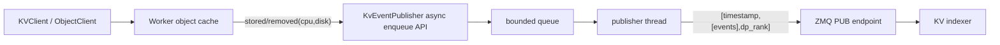
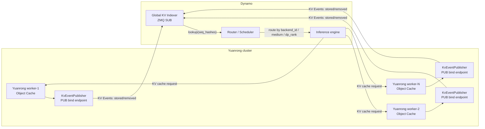

# Yuanrong KvEventPublisher 需求设计文档

## 1. 背景

Mooncake PR [kvcache-ai/Mooncake#2214](https://github.com/kvcache-ai/Mooncake/pull/2214) 在 `mooncake_master` 上新增了一个可选的 [RFC #1527](https://github.com/kvcache-ai/Mooncake/issues/1527) KV Events publisher。该 publisher 通过 ZMQ PUB 输出 MessagePack 批量事件，向 Dynamo global KV indexer 或兼容 RFC #1527 的 indexer 同步 KV cache block 的 `stored` / `removed` 状态。

Yuanrong Datasystem 当前也具备分布式 KV cache、worker 本地内存、spill、本地/二级缓存、对象元数据和驱逐流程。为了让外部全局 KV indexer 能感知 Yuanrong 中 KV block 的可用位置，需要在 Yuanrong 中实现类似的 `KvEventPublisher` 能力。

## 2. 现状

[RFC #1527](https://github.com/kvcache-ai/Mooncake/issues/1527) 定义的是一套面向 KV cache block 生命周期的事件流协议。推理后端或 KV cache 后端在 block 可用、不可用或整组清空时发布事件，外部 indexer 根据这些事件维护全局 KV block 位置索引。

### 2.1 Event 总览

包含三类 event：

| Event | 语义 |
| --- | --- |
| `stored` | 增加可用位置，表示一组 KV block 已经在某个 backend 的某个 medium 上可用 |
| `removed` | 删除可用位置，表示一组 KV block 已经从某个 backend 的某个 medium 上不可用 |
| `cleared` | 表示某个 publisher stream 对应范围内的 KV block 状态被整体清空 |

这三类 event 都是增量状态通知。KV indexer 接收事件后更新自己的全局索引

### 2.2 事件公共字段

所有事件共享同一组 envelope 字段：

| 字段 | 含义 |
| --- | --- |
| `event_id` | publisher 内部的事件序号，用于观测和同一 publisher stream 内排序 |
| `timestamp` | 事件产生时间，Unix epoch 毫秒 |
| `event_type` | 事件类型， `stored`、`removed`、`cleared` |
| `model_name` | KV block 所属模型名；未知时可为 `null` |
| `block_size` | block token 数；未知时可为 `null` |
| `additional_salt` | hash 额外 salt；无额外 salt 时可为 `null` |
| `lora_name` | LoRA 名称；无 LoRA 时可为 `null` |
| `tenant_id` | 租户标识，用于多租户隔离 |
| `backend_id` | 发布该事件的后端标识，indexer/router 用它定位后端 |
| `medium` | KV block 所在介质，例如 `cpu`、`disk` |
| `dp_rank` | data parallel rank |

这些字段共同构成 indexer 理解事件的身份空间。接入方需要保证 `model_name`、`block_size`、`additional_salt`、`lora_name`、`tenant_id`、`dp_rank` 与推理引擎侧 rolling hash 的语义一致。

### 2.3 stored event

`stored` 表示一组 KV block 已经在某个 backend 的某个 medium 上可用。

字段组成：

| 字段 | 含义 |
| --- | --- |
| 公共字段 | 见 2.2 |
| `seq_hashes` | 已存储 block 的 rolling hash 列表 |
| `base_block_idx` | `seq_hashes[0]` 对应的 block index；未知时可为 `null` |
| `parent_hash` | 前驱 block hash；无前驱或未知时可为 `null` |
| `token_ids` | 对应 token id 列表；未知时可为 `null` |

Yuanrong 当前只需要发布单个 block 对应的 `seq_hashes=[seq_hash]`。由于 Yuanrong worker 不维护 prefix tree，也不保存 token 列表，`base_block_idx`、`parent_hash`、`token_ids` 首期固定为 `null`。

### 2.4 removed event

`removed` 表示一组 KV block 已经从某个 backend 的某个 medium 上不可用。

字段组成：

| 字段 | 含义 |
| --- | --- |
| 公共字段 | 见 2.2 |
| `seq_hashes` | 被移除 block 的 rolling hash 列表 |
| `base_block_idx` | `seq_hashes[0]` 对应的 block index；未知时可为 `null` |

`removed` 只表示事件指定的 `(backend_id, medium, dp_rank)` 上不再可用，不表示所有 backend 或所有 medium 都删除。比如同一 key 同时存在 `cpu` 和 `disk`，释放内存只能发布 `removed(cpu)`，不能误发 `removed(disk)`。

### 2.5 cleared event

`cleared` 表示某个 publisher stream 对应范围内的 KV block 状态被整体清空。

字段组成：

| 字段 | 含义 |
| --- | --- |
| 公共字段 | 见 2.2 |


## 3. 目标

实现一个 Yuanrong worker 侧可选开启的 `KvEventPublisher`，用于将 KV cache 对象在 Yuanrong 中的介质状态变化发布给外部 indexer。

核心目标：

1. 支持 RFC #1527 风格的 ZMQ KV Events wire format。
2. 发布 `stored` 和 `removed` 事件，暂不发布 `cleared`。
3. 事件发布不在 Yuanrong 的 Set/Get/Delete/eviction 热路径执行 MessagePack 编码或 ZMQ IO；阶段 1 的入队模型与 Mooncake PR #2214 一致，队列满直接 drop，队列锁竞争时可能短暂等待。
4. 能区分至少两个逻辑介质：
   - `cpu`：worker 本地内存中的对象副本。
   - `disk`：worker 本地 spill 文件或 L2 persistence 中的对象副本。
5. 兼容 Mooncake PR #2214 的事件字段，并默认输出 vLLM/SGLang legacy 字段 `type` 和 `block_hashes`。
6. 对无法解析为 rolling `seq_hash` 的 key 跳过发布并计数，不影响原业务请求结果。

## 4. 方案

在 worker object cache 模块新增 `KvEventPublisher`，由 worker 启动时根据配置初始化。各对象生命周期路径在状态真正变化成功后调用 publisher 的异步入队接口。

### 4.1 总体架构

新增KvEventPublisher模块放在：

```text
src/datasystem/worker/object_cache/kv_event/
  kv_event_config.h
  kv_event_publisher.h
  kv_event_publisher.cpp
```

核心组件：

| 组件 | 职责 |
| --- | --- |
| `KvEventConfig` | 保存配置开关、ZMQ endpoint、身份字段、队列容量、兼容字段开关 |
| `KvEventPublisher` | 对外提供 `PublishStored/PublishRemoved` 异步入队接口；内部异步批量编码并发送 ZMQ 消息 |
| `KvEventPublisher::Stats` | 对齐 Mooncake，记录 published/dropped/skipped 等统计 |
| `KvEventKeyParser` | 从 Yuanrong namespace URI 或真实 object key 中解析 `seq_hash` |
| worker object-cache 调用点 | 在状态变化成功后调用 publisher |

数据流：



### 4.2 新增配置

只新增一个 gflag：

| 配置               | 类型   | 默认值 | 说明                                            |
| ------------------ | ------ | ------ | ----------------------------------------------- |
| `kv_events_config` | string | `""`   | KV Events publisher JSON 配置；空字符串表示关闭 |

`kv_events_config` 非空时按 JSON 解析，字段使用 Mooncake 风格 snake_case：

```json
{
  "bind_endpoint": "tcp://0.0.0.0:5557",
  "model_name": "",
  "backend_id": "datasystem-worker-10.0.0.1:31501",
  "tenant_id": "default",
  "additional_salt": "",
  "lora_name": "",
  "block_size": 0,
  "dp_rank": 0,
  "emit_legacy_compat_fields": true,
  "queue_capacity": 65536
}
```

`emit_legacy_compat_fields` 用于控制是否额外输出 Mooncake PR #2214 保留的 vLLM/SGLang legacy 兼容字段。默认值为 `true`，与 Mooncake 保持一致。该开关只影响 event object 中是否携带兼容字段，不影响 publisher 是否启动、不影响 ZMQ 三帧协议，也不影响 `stored` / `removed` 的标准字段。

开启时会额外输出：

| 标准字段 | legacy 兼容字段 | 说明 |
| --- | --- | --- |
| `event_type: "stored"` | `type: "BlockStored"` | stored event 的旧字段名 |
| `event_type: "removed"` | `type: "BlockRemoved"` | removed event 的旧字段名 |
| `seq_hashes` | `block_hashes` | 内容相同 |
| `parent_hash` | `parent_block_hash` | 仅 stored event 输出；当前固定为 `null` |

关闭时不输出 `type`、`block_hashes`、`parent_block_hash`。

配置校验：

- `kv_events_config=""` 时禁用 publisher。
- 非空 JSON 中 `bind_endpoint` 必须非空。
- 非空 JSON 中 `backend_id` 必须非空；阶段 1 不额外设计自动回退。
- `queue_capacity` 必须大于 0。
- 未出现的可选字段使用 `KvEventConfig` 默认值。


### 4.3 部署视图：Yuanrong 与 Dynamo 的交互

Yuanrong 不直接调用 Dynamo 的控制面 API。当前交互方式是 **Yuanrong worker 发布 KV Events，Dynamo global KV indexer 订阅这些事件并维护全局 KV block 位置索引**。

推荐部署关系：



部署时每个 Yuanrong worker 暴露一个独立的 ZMQ PUB endpoint：

```json
{
  "bind_endpoint": "tcp://0.0.0.0:5557",
  "backend_id": "datasystem-worker-10.0.0.1:31501",
  "model_name": "llama-3.1-8b",
  "block_size": 64,
  "tenant_id": "default",
  "dp_rank": 0
}
```

indexer 侧需要拿到所有 Yuanrong worker 的可连接地址，例如：

```text
tcp://worker-1:5557
tcp://worker-2:5557
tcp://worker-n:5557
```

职责边界：

| 组件 | 职责 |
| --- | --- |
| Yuanrong worker | 在本 worker 的 object cache 状态变化成功后发布 `stored` / `removed` 事件 |
| `KvEventPublisher` | 将事件异步批量编码为 Mooncake/RFC #1527 兼容的 ZMQ 三帧消息 |
| Dynamo global KV indexer | 订阅所有 worker 的 PUB endpoint，按事件更新 `seq_hashes -> backend_id/medium/dp_rank` 索引 |
| Dynamo router/scheduler | 查询 indexer，选择有目标 KV block 的后端或介质 |
| 推理引擎 | 按 Dynamo 路由结果访问 Yuanrong 中对应 worker 的 KV cache |

交互流程：

1. Yuanrong worker 启动，`kv_events_config` 非空时创建 `KvEventPublisher`，并 bind `bind_endpoint`。
2. Dynamo indexer 启动后连接所有 Yuanrong worker 的 PUB endpoint。
3. Yuanrong 业务路径完成 Set/Put/Delete/eviction 等状态变化后调用 `PublishStored()` 或 `PublishRemoved()`。
4. Publisher 后台线程发送三帧 ZMQ 消息：空 topic、publisher sequence、msgpack payload。
5. Dynamo indexer 解码 payload，根据事件中的 `tenant_id`、`model_name`、`block_size`、`additional_salt`、`lora_name`、`seq_hashes`、`backend_id`、`medium`、`dp_rank` 更新全局索引。
6. Dynamo router/scheduler 查询 indexer，决定请求是否可以路由到已有 KV block 的 Yuanrong worker。

关键约束：

- `backend_id` 必须是 Dynamo 能识别并用于路由的 Yuanrong 后端标识。首期不在 Yuanrong 内自动生成，直接从 `kv_events_config.backend_id` 读取。
- Dynamo 只通过事件感知 Yuanrong KV block 状态；事件 drop、indexer 晚启动或网络断开会导致 indexer 状态不完整。首期只提供 best-effort 发布，不提供 snapshot/replay。
- Yuanrong worker 不等待 Dynamo 消费确认；ZMQ PUB/SUB 没有 per-event ack，发布失败或队列满都不影响业务请求结果。
- `model_name`、`block_size`、`additional_salt`、`lora_name` 必须和 Dynamo/推理引擎侧计算 rolling hash 时使用的语义一致，否则 indexer 即使收到事件也无法正确命中。

### 4.4. Yuanrong 事件适配

#### ZMQ 帧格式

与 Mooncake PR #2214 保持一致：

```text
frame 1: empty topic
frame 2: big-endian uint64 publisher sequence
frame 3: msgpack payload: [timestamp_ms, [events...], dp_rank]
```

说明：

- 这三帧组成一次 ZMQ PUB message。`stored event` / `removed event` 不是额外的 frame，而是 frame 3 中 `events` 数组里的 object。
- `frame 1` 是空 topic，内容长度为 0。ZMQ PUB/SUB 支持 topic 前缀过滤；这里不做 topic 分流，因此发送一个空帧作为 topic，占位并兼容 Mooncake PR #2214 的三帧格式。
- `publisher sequence` 是 ZMQ 批次序号，按 publisher stream 单调递增。
- `event_id` 是 event 级序号，按 publisher stream 单调递增。
- `timestamp_ms` 是 Unix epoch 毫秒，仅用于观测，不作为排序依据。

示例：如果一次 batch 中只有一个 `stored` event，则三帧可以理解为：

```text
frame 1 bytes: ""
frame 2 bytes: 00 00 00 00 00 00 00 07
frame 3 decoded msgpack:
[
  1770000000000,
  [
    {
      "event_id": 1,
      "timestamp": 1770000000000,
      "event_type": "stored",
      "type": "BlockStored",
      "model_name": "llama-3.1-8b",
      "block_size": 64,
      "additional_salt": null,
      "lora_name": null,
      "tenant_id": "tenant-a",
      "backend_id": "datasystem-worker-10.0.0.1:31501",
      "medium": "cpu",
      "dp_rank": 0,
      "seq_hashes": [123456789],
      "block_hashes": [123456789],
      "base_block_idx": null,
      "parent_hash": null,
      "token_ids": null,
      "parent_block_hash": null
    }
  ],
  0
]
```

其中 `frame 2` 的 `7` 是这个 ZMQ batch 的序号；`frame 3[1][0].event_id = 1` 是 batch 内这个 event 的事件序号。一个 frame 3 可以包含多个 event，例如 `[timestamp_ms, [stored_event, removed_event], dp_rank]`。

#### stored event

下面的示例是 frame 3 的 `events` 数组里的一个元素。

```json
{
  "event_id": 1,
  "timestamp": 1770000000000,
  "event_type": "stored",
  "type": "BlockStored",
  "model_name": "llama-3.1-8b",
  "block_size": 64,
  "additional_salt": null,
  "lora_name": null,
  "tenant_id": "tenant-a",
  "backend_id": "datasystem-worker-10.0.0.1:31501",
  "medium": "cpu",
  "dp_rank": 0,
  "seq_hashes": [123456789],
  "block_hashes": [123456789],
  "base_block_idx": null,
  "parent_hash": null,
  "token_ids": null,
  "parent_block_hash": null
}
```

字段说明：

| 字段 | 首期来源 |
| --- | --- |
| `event_id` | publisher 内部原子递增 |
| `timestamp` | publisher 线程打包批次时生成 |
| `event_type` | `stored` |
| `type` | legacy 兼容字段，`emit_legacy_compat_fields=true` 时固定 `BlockStored` |
| `model_name` | `kv_events_config.model_name`；空值编码为 `null` |
| `block_size` | `kv_events_config.block_size`；0 编码为 `null` |
| `additional_salt` | `kv_events_config.additional_salt`；空值编码为 `null` |
| `lora_name` | `kv_events_config.lora_name`；空值编码为 `null` |
| `tenant_id` | 从 Yuanrong namespace URI 提取，失败时使用配置默认值 |
| `backend_id` | `kv_events_config.backend_id` |
| `medium` | `cpu` 或 `disk` |
| `dp_rank` | `kv_events_config.dp_rank` |
| `seq_hashes` | 从真实 object key 解析出的单个 rolling `seq_hash` |
| `block_hashes` | legacy 兼容字段，`emit_legacy_compat_fields=true` 时等同 `seq_hashes` |
| `base_block_idx` | 首期未知，固定 `null` |
| `parent_hash` | Yuanrong worker 不维护 prefix tree，固定 `null` |
| `token_ids` | Yuanrong worker 不保存 token 列表，固定 `null` |
| `parent_block_hash` | legacy 兼容字段，`emit_legacy_compat_fields=true` 时固定 `null` |

#### removed event

示例：

```json
{
  "event_id": 2,
  "timestamp": 1770000000000,
  "event_type": "removed",
  "type": "BlockRemoved",
  "model_name": "llama-3.1-8b",
  "block_size": 64,
  "additional_salt": null,
  "lora_name": null,
  "tenant_id": "tenant-a",
  "backend_id": "datasystem-worker-10.0.0.1:31501",
  "medium": "cpu",
  "dp_rank": 0,
  "seq_hashes": [123456789],
  "block_hashes": [123456789],
  "base_block_idx": null
}
```

#### 不发布 cleared

当前暂不发布 `cleared`。如果后续 Yuanrong 有明确的全量 KV cache reset/clear 入口，并且能够确定作用域为某个 publisher stream，可再增加 `PublishCleared()`。

### 4.5 事件触发矩阵

Mooncake PR #2214 只在 master metadata 最终失效时发 `removed`，这对 Yuanrong 不够精确。Yuanrong 需要按介质生命周期发布事件，避免 indexer 中留下错误的 tier 命中。

推荐首期触发矩阵如下：

| 场景 | Yuanrong 代码路径 | 事件 | 说明 |
| --- | --- | --- | --- |
| Set/Put 发布成功，数据在 worker 内存可读 | `WorkerOcServicePublishImpl::PublishObject()` 成功设置 `CacheInvalid=false` 后 | `stored(cpu)` | 表示 worker 本地内存 tier 可用 |
| write-through L2 保存成功 | `SaveBinaryObjectToPersistence()` 返回成功后 | `stored(disk)` | 表示 L2/disk tier 可用 |
| write-back L2 异步保存成功 | `AsyncSendManager::AfterSendToRemote()` 成功后 | `stored(disk)` | 不能在 `Add()` 时发，必须等持久化成功 |
| 对象从 local memory spill 到本地 spill 文件成功 | `WorkerOcEvictionManager::SpillImpl()` 设置 `SetSpillState(true)` 后 | `stored(disk)` + `removed(cpu)` | 先发布 disk 可用，再发布 cpu 移除；同一批中顺序由 event_id 保证 |
| 从 spill 文件恢复到内存 | 现有 get/migrate/recovery 读回路径中设置内存可用后 | `stored(cpu)` | 如果 disk 文件仍存在，不发 `removed(disk)` |
| 用户删除对象所有副本 | `WorkerOcServiceDeleteImpl::DeleteAllCopyWithLock()` 中 `ClearObject()` 成功后 | `removed(cpu)`，如对象有 spill 则 `removed(disk)` | L2 persistence 删除如果异步或由 master 触发，需要在真正删除成功处补 `removed(disk)` |
| master 通知 worker 删除副本 | `DeleteObjectFromNotification()` 中 `ClearObject()` 成功后 | `removed(cpu)`，如对象有 spill 则 `removed(disk)` | 只在本 worker 副本删除成功后发布 |
| eviction 删除内存对象且对象仍有 L2 | `WorkerOcEvictionManager::EvictObject(Action::DELETE)` 成功后 | `removed(cpu)` | 不能误发 `removed(disk)` |
| eviction 删除无 L2 evictable 对象 | `DeleteNoneL2CacheEvictableObject()` 成功后 | `removed(cpu)`，如有 spill 则 `removed(disk)` | 表示该 worker 不再持有任何 tier |
| spill 文件删除但 L2 仍可用 | `DeleteObjectFromDisk()` 或 `DeleteL2CacheEvictableObject()` 成功后 | `removed(disk)` | 仅表示本地 spill disk 副本消失；如果 L2 也代表 `disk`，需要区分 medium 子类型，见下文 |
| metadata recovery 从 L2 恢复对象 | `MetadataRecoveryManager` 成功重建可读对象后 | `stored(cpu)` 或 `stored(disk)` | 首期可暂不补发启动前状态；如果恢复后对象立即服务，需要发布 |

关键约束：

- 事件必须在状态变化成功后发布，不能在即将执行时发布。
- 不能把“对象 metadata 删除”简单等同于所有介质删除。
- 如果同一 object key 同时存在 memory 和 disk，删除 memory 只能发 `removed(cpu)`。


### 4.6. 可观测性

首期只保留 Mooncake 同等的 `GetStats()` 和日志，不新增 HTTP endpoint，不新增 Yuanrong metrics 注册项。

`GetStats()` 返回与 Mooncake 对齐的字段：

| 字段 | 含义 |
| --- | --- |
| `publishedBatches` | 成功发送的 batch 数 |
| `publishedEvents` | 成功打包发送的 event 数 |
| `droppedEvents` | 队列满丢弃的 event 数 |
| `skippedUnparsedKeys` | key 无法解析导致跳过的 event 数 |

日志策略：

- publisher 启动/关闭打印 INFO。
- 配置错误打印 ERROR 并禁用 publisher。
- send 失败按限频策略打印 WARNING/ERROR，避免日志风暴。
- key 解析失败只计数，按采样或限频打印，避免暴露大量用户 key。

## 5. 对外语义约束

接入方必须满足：

1. 用作 KV cache block 的 Yuanrong object key 必须能解析出 rolling `seq_hash`。
2. `model_name`、`block_size`、`additional_salt`、`lora_name` 必须与推理引擎侧 hash 语义一致。
4. indexer 必须按 `(tenant_id, model_name, block_size, additional_salt, lora_name, backend_id, medium, dp_rank)` 理解事件流。

## 6. 实现步骤

建议分阶段实现。

### 阶段 1：publisher 基础能力

1. 新增 `kv_event_config.h`、`kv_event_publisher.h/cpp`。
2. 实现 key parser、stats、bounded queue、后台线程、ZMQ PUB bind、MessagePack batch encode。
3. 增加单字符串 JSON gflag 和配置解析/校验。
4. 在 worker 启动时创建 publisher，在 shutdown 时停止。
5. 暂只接入一个低风险手动测试入口或单元测试，不接业务生命周期。

### 阶段 2：stored(cpu) 和 removed(cpu)

1. 在 `WorkerOcServicePublishImpl::PublishObject()` 成功后发布 `stored(cpu)`。
2. 在 `WorkerOcServiceCrudCommonApi::ClearObject()` 成功 erase 后发布 `removed(cpu)`。
3. 在 `WorkerOcEvictionManager::EvictObject(Action::DELETE/FREE_MEMORY)` 成功后发布对应 `removed(cpu)`。
4. 补充单元测试和 worker 级集成测试。

### 阶段 3：disk/L2 生命周期

1. 在 `SaveBinaryObjectToPersistence()` 成功后发布 `stored(disk)`。
2. 在 `AsyncSendManager::AfterSendToRemote()` 成功后发布 `stored(disk)`。
3. 在 `WorkerOcEvictionManager::SpillImpl()` spill 成功后发布 `stored(disk)` 和 `removed(cpu)`。
4. 在 `DeleteObjectFromDisk()` / `DeleteL2CacheEvictableObject()` 成功后发布 `removed(disk)`。
5. 明确 local spill 与 L2 persistence 同为 `disk` 的语义边界。

### 阶段 4：恢复与迁移补齐

1. 梳理 `MetadataRecoveryManager` 和迁移路径。
2. 对恢复后立即可读的对象发布 `stored(cpu)` 或 `stored(disk)`。
3. 对迁移源和目标的介质状态变化补齐 `removed` / `stored`。
4. 增加恢复/迁移场景测试。

## 7. 测试计划

### 单元测试

- `ParseSeqHashFromObjectKey`
  - 十进制 key。
  - `0x` / `0X` 十六进制 key。
  - 带 tenant namespace 的 key。
  - 空 key、非法 key、尾部混杂字符。
- disabled publisher no-op。
- 队列满 drop 计数。
- MessagePack payload round-trip：
  - 用 `nlohmann_json::from_msgpack` 解码验证字段。
  - 验证 legacy compat 开关。
  - 验证 `block_size=0` 编码为 `null`。

### 组件/集成测试

- 启动 worker，设置非空 `kv_events_config`，测试进程作为 ZMQ SUB 订阅。
- KV Set 一个可解析 key，收到 `stored(cpu)`。
- KV Del 后收到 `removed(cpu)`。
- write-through L2 模式下收到 `stored(disk)`。
- write-back L2 模式下只有异步保存成功后收到 `stored(disk)`。
- spill 成功后收到 `stored(disk)` 和 `removed(cpu)`，顺序按 event_id 保持。
- 非法 key 请求业务成功，但不发事件，`skipped_unparsed_keys` 增加。

### 失败测试

- `kv_events_config` 中的 `bind_endpoint` 无法 bind：publisher 禁用，worker 启动策略需要明确。建议首期不阻止 worker 启动。
- ZMQ send 失败：业务请求不失败，后台线程限频记录日志。
- 队列满：业务请求不失败，只 drop event。
- shutdown 时有未发送事件：按 Mooncake 析构流程尽力 drain。

### 性能验证

- 对比 `kv_events_config=""` 与非空配置时 KV Set/Del p50/p99。
- 压测队列满场景，确认热路径不会被 ZMQ 消费端速度拖慢。
- 检查锁持有区间内是否只执行轻量入队，不做编码和 IO。

## 8. 验收标准

1. 默认关闭，对现有 Yuanrong 行为无影响。
2. 开启后 worker 能 bind 配置的 ZMQ PUB endpoint。
3. 对合法 rolling hash key，Set 成功后可收到 `stored(cpu)`。
4. 对合法 rolling hash key，Delete 成功后可收到 `removed(cpu)`。
5. write-through/write-back 或 spill 成功后能发布 `stored(disk)`，对应介质删除时能发布 `removed(disk)`。
6. 非法 key 不影响业务请求，事件被跳过且计数正确。
7. 队列满、send 失败、publisher 初始化失败都不影响业务请求结果。
8. 单元测试覆盖 key parser、payload encoding、disabled no-op、queue drop。
9. 至少一个 worker 集成测试用 ZMQ SUB 验证真实 wire payload。
