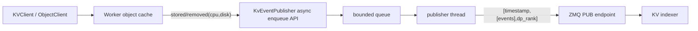

# Yuanrong KvEventPublisher 需求设计文档

## 1. 背景

Mooncake PR [kvcache-ai/Mooncake#2214](https://github.com/kvcache-ai/Mooncake/pull/2214) 在 `mooncake_master` 上新增了一个可选的 RFC #1527 KV Events publisher。该 publisher 通过 ZMQ PUB 输出 MessagePack 批量事件，向 Dynamo global KV indexer 或兼容 RFC #1527 的 indexer 同步 KV cache block 的 `stored` / `removed` 状态。

Yuanrong Datasystem 当前也具备分布式 KV cache、worker 本地内存、spill、本地/二级缓存、对象元数据和驱逐流程。为了让外部全局 KV indexer 能感知 Yuanrong 中 KV block 的可用位置，需要在 Yuanrong 中实现类似的 `KvEventPublisher` 能力。

## 2. 目标

实现一个 Yuanrong worker 侧可选开启的 `KvEventPublisher`，用于将 KV cache 对象在 Yuanrong 中的介质状态变化发布给外部 indexer。

核心目标：

1. 支持 RFC #1527 风格的 ZMQ KV Events wire format。
2. 首期发布 `stored` 和 `removed` 事件，不发布 `cleared`。
3. 事件发布不在 Yuanrong 的 Set/Get/Delete/eviction 热路径执行 MessagePack 编码或 ZMQ IO；阶段 1 的入队模型与 Mooncake PR #2214 一致，队列满直接 drop，队列锁竞争时可能短暂等待。
4. 能区分至少两个逻辑介质：
   - `cpu`：worker 本地内存中的对象副本。
   - `disk`：worker 本地 spill 文件或 L2 persistence 中的对象副本。
5. 兼容 Mooncake PR #2214 的事件字段，并默认输出 vLLM/SGLang legacy 字段 `type` 和 `block_hashes`。
6. 对无法解析为 rolling `seq_hash` 的 key 跳过发布并计数，不影响原业务请求结果。

非目标：

- 首期不实现 indexer，不实现 `/register` / `/query` 服务。
- 首期不实现事件 replay endpoint。
- 首期不在进程启动时扫描全量现有对象并补发状态快照。
- 首期不支持 `cleared` / `AllBlocksCleared`。
- 首期不重新定义 Yuanrong KV key 生成规则；要求接入方按约定将 rolling `seq_hash` 编码进 key。

## 3. 推荐方案

推荐采用 **worker 侧生命周期事件发布器**。

### 方案 A：worker 侧 lifecycle publisher（推荐）

在 worker object cache 模块新增 `KvEventPublisher`，由 worker 启动时根据配置初始化。各对象生命周期路径在状态真正变化成功后调用 publisher 的异步入队接口。

优点：

- Yuanrong 的数据实际可用性由 worker object cache、spill、L2 persistence 决定，worker 侧最接近真实状态。
- 可以精确区分 `cpu` 与 `disk` 的 stored/removed。
- 不需要 master 聚合所有数据路径，降低 master 耦合。
- 与 Yuanrong 现有 `AsyncSendManager`、`WorkerOcEvictionManager`、`WorkerOcServiceCrudCommonApi` 边界匹配。

缺点：

- 需要在多个生命周期路径中接入事件发布，必须维护触发矩阵，避免漏发或重复语义不一致。

### 方案 B：master 侧 metadata publisher

在 master object cache metadata 更新成功后发布事件，类似 Mooncake PR #2214 的 master publisher。

优点：

- 接入点相对集中。
- 事件顺序更接近元数据顺序。

缺点：

- Yuanrong 的 `cpu` 内存释放、spill、L2 持久化完成等真实介质状态在 worker 侧发生，master metadata 无法精确表达。
- 容易出现 indexer 认为 `cpu` 命中仍然存在但 worker 已经释放内存的错误。

### 方案 C：persistence 层 publisher

只在 `PersistenceApi::Save/Del` 和 local spill 层发布 `disk` 事件。

优点：

- 对 L2/disk 状态比较准确。
- 对内存热路径侵入小。

缺点：

- 无法覆盖 `cpu` tier，外部 router 无法做完整的 tiered cache-aware routing。
- 无法表达纯内存 KV cache。

结论：选择方案 A。方案 B 和 C 可作为后续补充，不作为首期实现。

## 4. 总体架构

新增模块建议放在：

```text
src/datasystem/worker/object_cache/kv_event/
  kv_event_config.h
  kv_event_publisher.h
  kv_event_publisher.cpp
```

核心组件：

| 组件 | 职责 |
| --- | --- |
| `KvEventConfig` | 保存配置开关、ZMQ endpoint、身份字段、队列容量、兼容字段开关 |
| `KvEventPublisher` | 对外提供 `PublishStored/PublishRemoved` 异步入队接口；内部异步批量编码并发送 ZMQ 消息 |
| `KvEventPublisher::Stats` | 对齐 Mooncake，记录 published/dropped/skipped 等统计 |
| `KvEventKeyParser` | 从 Yuanrong namespace URI 或真实 object key 中解析 `seq_hash` |
| worker object-cache 调用点 | 在状态变化成功后调用 publisher |

推荐数据流：



## 5. 事件协议

### 5.1 ZMQ 帧格式

与 Mooncake PR #2214 保持一致：

```text
frame 1: empty topic
frame 2: big-endian uint64 publisher sequence
frame 3: msgpack payload: [timestamp_ms, [events...], dp_rank]
```

说明：

- 这三帧组成一次 ZMQ PUB message。`stored event` / `removed event` 不是额外的 frame，而是 frame 3 中 `events` 数组里的 object。
- `frame 1` 是空 topic，内容长度为 0。ZMQ PUB/SUB 支持 topic 前缀过滤；这里不做 topic 分流，因此发送一个空帧作为 topic，占位并兼容 Mooncake PR #2214 的三帧格式。
- `publisher sequence` 是 ZMQ 批次序号，按 publisher stream 单调递增。
- `event_id` 是 event 级序号，按 publisher stream 单调递增。
- `timestamp_ms` 是 Unix epoch 毫秒，仅用于观测，不作为排序依据。

示例：如果一次 batch 中只有一个 `stored` event，则三帧可以理解为：

```text
frame 1 bytes: ""
frame 2 bytes: 00 00 00 00 00 00 00 07
frame 3 decoded msgpack:
[
  1770000000000,
  [
    {
      "event_id": 1,
      "timestamp": 1770000000000,
      "event_type": "stored",
      "type": "BlockStored",
      "model_name": "llama-3.1-8b",
      "block_size": 64,
      "additional_salt": null,
      "lora_name": null,
      "tenant_id": "tenant-a",
      "backend_id": "datasystem-worker-10.0.0.1:31501",
      "medium": "cpu",
      "dp_rank": 0,
      "seq_hashes": [123456789],
      "block_hashes": [123456789],
      "base_block_idx": null,
      "parent_hash": null,
      "token_ids": null,
      "parent_block_hash": null
    }
  ],
  0
]
```

其中 `frame 2` 的 `7` 是这个 ZMQ batch 的序号；`frame 3[1][0].event_id = 1` 是 batch 内这个 event 的事件序号。一个 frame 3 可以包含多个 event，例如 `[timestamp_ms, [stored_event, removed_event], dp_rank]`。

### 5.2 stored event

下面的示例是 frame 3 的 `events` 数组里的一个元素。

```json
{
  "event_id": 1,
  "timestamp": 1770000000000,
  "event_type": "stored",
  "type": "BlockStored",
  "model_name": "llama-3.1-8b",
  "block_size": 64,
  "additional_salt": null,
  "lora_name": null,
  "tenant_id": "tenant-a",
  "backend_id": "datasystem-worker-10.0.0.1:31501",
  "medium": "cpu",
  "dp_rank": 0,
  "seq_hashes": [123456789],
  "block_hashes": [123456789],
  "base_block_idx": null,
  "parent_hash": null,
  "token_ids": null,
  "parent_block_hash": null
}
```

字段说明：

| 字段 | 首期来源 |
| --- | --- |
| `event_id` | publisher 内部原子递增 |
| `timestamp` | publisher 线程打包批次时生成 |
| `event_type` | `stored` |
| `type` | legacy 兼容字段，固定 `BlockStored`，可关闭 |
| `model_name` | `kv_events_model_name`；空值编码为 `null` |
| `block_size` | `kv_events_block_size`；0 编码为 `null` |
| `additional_salt` | `kv_events_additional_salt`；空值编码为 `null` |
| `lora_name` | `kv_events_lora_name`；空值编码为 `null` |
| `tenant_id` | 从 Yuanrong namespace URI 提取，失败时使用配置默认值 |
| `backend_id` | `kv_events_backend_id`；默认可取 `worker_address` |
| `medium` | `cpu` 或 `disk` |
| `dp_rank` | `kv_events_dp_rank` |
| `seq_hashes` | 从真实 object key 解析出的单个 rolling `seq_hash` |
| `block_hashes` | legacy 兼容字段，等同 `seq_hashes`，可关闭 |
| `base_block_idx` | 首期未知，固定 `null` |
| `parent_hash` | Yuanrong worker 不维护 prefix tree，固定 `null` |
| `token_ids` | Yuanrong worker 不保存 token 列表，固定 `null` |
| `parent_block_hash` | legacy 兼容字段，固定 `null`，可关闭 |

### 5.3 removed event

示例：

```json
{
  "event_id": 2,
  "timestamp": 1770000000000,
  "event_type": "removed",
  "type": "BlockRemoved",
  "model_name": "llama-3.1-8b",
  "block_size": 64,
  "additional_salt": null,
  "lora_name": null,
  "tenant_id": "tenant-a",
  "backend_id": "datasystem-worker-10.0.0.1:31501",
  "medium": "cpu",
  "dp_rank": 0,
  "seq_hashes": [123456789],
  "block_hashes": [123456789],
  "base_block_idx": null
}
```

### 5.4 不发布 cleared

首期不发布 `cleared`。如果后续 Yuanrong 有明确的全量 KV cache reset/clear 入口，并且能够确定作用域为某个 publisher stream，可再增加 `PublishCleared()`。

## 6. Key 解析约定

Yuanrong worker 内部 object key 可能带 tenant namespace。当前 `TenantAuthManager::ConstructNamespaceUriWithTenantId()` 会生成：

```text
<tenant_id>/<object_key>
```

因此 publisher 解析 key 时必须先取真实 object key，再解析 `seq_hash`。

首期规则：

1. 输入为 Yuanrong namespace URI。
2. 使用 `TenantAuthManager::ExtractTenantId()` 得到 `tenant_id`。
3. 使用 `TenantAuthManager::ExtractRealObjectKey()` 或等价逻辑得到真实 object key。
4. 真实 object key 必须是：
   - 十进制 `u64`，例如 `123456789`
   - 或 `0x` / `0X` 前缀十六进制 `u64`，例如 `0x75bcd15`
5. 解析失败时跳过该事件，`skipped_unparsed_keys` 加一，不影响业务请求。

首期不建议支持复杂正则解析。正则会增加热路径配置复杂度，也容易导致不同部署的 key 语义不一致。确有需要时可后续增加 `kv_events_key_parse_mode=suffix_u64` 一类的明确模式。

## 7. 触发矩阵

Mooncake PR #2214 只在 master metadata 最终失效时发 `removed`，这对 Yuanrong 不够精确。Yuanrong 需要按介质生命周期发布事件，避免 indexer 中留下错误的 tier 命中。

推荐首期触发矩阵如下：

| 场景 | Yuanrong 代码路径 | 事件 | 说明 |
| --- | --- | --- | --- |
| Set/Put 发布成功，数据在 worker 内存可读 | `WorkerOcServicePublishImpl::PublishObject()` 成功设置 `CacheInvalid=false` 后 | `stored(cpu)` | 表示 worker 本地内存 tier 可用 |
| write-through L2 保存成功 | `SaveBinaryObjectToPersistence()` 返回成功后 | `stored(disk)` | 表示 L2/disk tier 可用 |
| write-back L2 异步保存成功 | `AsyncSendManager::AfterSendToRemote()` 成功后 | `stored(disk)` | 不能在 `Add()` 时发，必须等持久化成功 |
| 对象从 local memory spill 到本地 spill 文件成功 | `WorkerOcEvictionManager::SpillImpl()` 设置 `SetSpillState(true)` 后 | `stored(disk)` + `removed(cpu)` | 先发布 disk 可用，再发布 cpu 移除；同一批中顺序由 event_id 保证 |
| 从 spill 文件恢复到内存 | 现有 get/migrate/recovery 读回路径中设置内存可用后 | `stored(cpu)` | 如果 disk 文件仍存在，不发 `removed(disk)` |
| 用户删除对象所有副本 | `WorkerOcServiceDeleteImpl::DeleteAllCopyWithLock()` 中 `ClearObject()` 成功后 | `removed(cpu)`，如对象有 spill 则 `removed(disk)` | L2 persistence 删除如果异步或由 master 触发，需要在真正删除成功处补 `removed(disk)` |
| master 通知 worker 删除副本 | `DeleteObjectFromNotification()` 中 `ClearObject()` 成功后 | `removed(cpu)`，如对象有 spill 则 `removed(disk)` | 只在本 worker 副本删除成功后发布 |
| eviction 删除内存对象且对象仍有 L2 | `WorkerOcEvictionManager::EvictObject(Action::DELETE)` 成功后 | `removed(cpu)` | 不能误发 `removed(disk)` |
| eviction 删除无 L2 evictable 对象 | `DeleteNoneL2CacheEvictableObject()` 成功后 | `removed(cpu)`，如有 spill 则 `removed(disk)` | 表示该 worker 不再持有任何 tier |
| spill 文件删除但 L2 仍可用 | `DeleteObjectFromDisk()` 或 `DeleteL2CacheEvictableObject()` 成功后 | `removed(disk)` | 仅表示本地 spill disk 副本消失；如果 L2 也代表 `disk`，需要区分 medium 子类型，见下文 |
| metadata recovery 从 L2 恢复对象 | `MetadataRecoveryManager` 成功重建可读对象后 | `stored(cpu)` 或 `stored(disk)` | 首期可暂不补发启动前状态；如果恢复后对象立即服务，需要发布 |

关键约束：

- 事件必须在状态变化成功后发布，不能在即将执行时发布。
- 不能把“对象 metadata 删除”简单等同于所有介质删除。
- 如果同一 object key 同时存在 memory 和 disk，删除 memory 只能发 `removed(cpu)`。

## 8. medium 语义

首期对外只输出 RFC 常见值：

| Yuanrong 状态 | `medium` |
| --- | --- |
| worker 共享内存 / 本地内存对象可读 | `cpu` |
| local spill 文件可读 | `disk` |
| L2 persistence 可读，包含 `obs` / `sfs` / `distributed_disk` | `disk` |

风险：local spill 与 L2 persistence 都映射到 `disk`，indexer 无法区分“本 worker spill 文件”和“共享 L2 backend”。如果部署需要区分，可以二期增加：

- `medium_detail`: `spill` / `l2_obs` / `l2_sfs` / `l2_distributed_disk`
- 或将 `medium` 扩展为 `disk:spill`、`disk:l2`，但这需要 indexer 明确支持。

首期建议保持 `medium=cpu|disk`，优先兼容 Mooncake/Dynamo 现有语义。

## 9. 配置

新增 gflags 建议：

| 配置 | 类型 | 默认值 | 说明 |
| --- | --- | --- | --- |
| `enable_kv_events` | bool | `false` | 是否启用 KV Events publisher |
| `kv_events_bind_endpoint` | string | `""` | ZMQ PUB bind 地址，例如 `tcp://0.0.0.0:5557` |
| `kv_events_model_name` | string | `""` | 事件中的 `model_name` |
| `kv_events_backend_id` | string | `""` | 事件中的 `backend_id`；空值时可回退为 `worker_address` |
| `kv_events_tenant_id` | string | `default` | 无法从 key 提取 tenant 时的默认值 |
| `kv_events_additional_salt` | string | `""` | hash namespace salt |
| `kv_events_lora_name` | string | `""` | LoRA 名称 |
| `kv_events_block_size` | uint32 | `0` | 0 表示事件中编码为 `null` |
| `kv_events_dp_rank` | uint32 | `0` | data parallel rank |
| `kv_events_emit_legacy_compat` | bool | `true` | 是否输出 `type`、`block_hashes`、`parent_block_hash` |
| `kv_events_queue_capacity` | uint32 | `65536` | 内存中的事件队列容量 |

配置校验：

- `enable_kv_events=true` 时，`kv_events_bind_endpoint` 必须非空。
- `backend_id` 为空时优先使用 `worker_address`，如果 `worker_address` 也为空则禁用 publisher 并记录错误。
- `kv_events_queue_capacity` 必须大于 0。

## 10. 编码与依赖

Yuanrong 已有 ZeroMQ 第三方依赖，见 `cmake/external_libs/libzmq.cmake`，并且 worker/object-cache 已链接 `common_rpc_zmq`。首期 publisher 可以将 ZMQ PUB 的 raw socket 封装在 `KvEventPublisher` 内部，避免影响现有 RPC 框架。

MessagePack 编码建议使用现有 `nlohmann_json::to_msgpack`，而不是新增 `msgpack-c` 依赖：

- Yuanrong CMake 已引入 `nlohmann_json`。
- 事件打包发生在 publisher 后台线程，不在请求线程直接编码。
- 使用 JSON object 构造事件可以降低首期实现复杂度。

注意：

- 热路径只创建轻量 `PendingEvent` 并入队，不做 JSON/MessagePack 编码。
- `nlohmann_json` 构造和 `to_msgpack` 仅在后台线程执行。
- 如果后续性能评估显示 JSON 中间对象成本过高，再切换为手写 MessagePack packer。

## 11. 并发与背压

`KvEventPublisher` 内部使用有界队列和单后台线程：

```text
request thread -> Enqueue(PendingEvent) -> publisher worker thread -> batch encode -> zmq_send
```

要求：

- `PublishStored/PublishRemoved` 不阻塞 ZMQ IO。
- `Enqueue()` 阶段 1 参考 Mooncake，使用 `queue_mutex + std::deque + condition_variable` 的有界队列。
- 队列满时直接 drop 新事件，`dropped_events` 加一。
- 队列锁竞争时业务线程可能短暂等待；阶段 1 与 Mooncake 保持一致，不额外设计队列替换方案。
- publisher 析构时停止接收新事件，并尽量 drain 队列中已有事件。
- 不能在持有 object table 锁时执行 ZMQ send 或 MessagePack 编码。
- `PendingEvent` 只保存必要字段：
  - namespace URI / object key
  - event kind
  - medium

Yuanrong 阶段 1 不额外设计 Mooncake 之外的 replay、snapshot、独立 metrics endpoint 或队列优化；只做必要的 Yuanrong 适配。

## 12. 可观测性

首期只保留 Mooncake 同等的 `GetStats()` 和日志，不新增 HTTP endpoint，不新增 Yuanrong metrics 注册项。

`GetStats()` 返回与 Mooncake 对齐的字段：

| 字段 | 含义 |
| --- | --- |
| `publishedBatches` | 成功发送的 batch 数 |
| `publishedEvents` | 成功打包发送的 event 数 |
| `droppedEvents` | 队列满丢弃的 event 数 |
| `skippedUnparsedKeys` | key 无法解析导致跳过的 event 数 |

日志策略：

- publisher 启动/关闭打印 INFO。
- 配置错误打印 ERROR 并禁用 publisher。
- send 失败按限频策略打印 WARNING/ERROR，避免日志风暴。
- key 解析失败只计数，按采样或限频打印，避免暴露大量用户 key。

## 13. 对外语义约束

接入方必须满足：

1. 用作 KV cache block 的 Yuanrong object key 必须能解析出 rolling `seq_hash`。
2. `model_name`、`block_size`、`additional_salt`、`lora_name` 必须与推理引擎侧 hash 语义一致。
3. 如果同一 Yuanrong worker 承载多个模型或多个 hash namespace，首期静态配置可能不够，需要按 key 前缀或 client metadata 动态填充 envelope 字段；这属于二期能力。
4. indexer 必须按 `(tenant_id, model_name, block_size, additional_salt, lora_name, backend_id, medium, dp_rank)` 理解事件流。

## 14. 实现步骤

建议分阶段实现。

### 阶段 1：publisher 基础能力

1. 新增 `kv_event_config.h`、`kv_event_publisher.h/cpp`。
2. 实现 key parser、stats、bounded queue、后台线程、ZMQ PUB bind、MessagePack batch encode。
3. 增加 gflags 和配置校验。
4. 在 worker 启动时创建 publisher，在 shutdown 时停止。
5. 暂只接入一个低风险手动测试入口或单元测试，不接业务生命周期。

### 阶段 2：stored(cpu) 和 removed(cpu)

1. 在 `WorkerOcServicePublishImpl::PublishObject()` 成功后发布 `stored(cpu)`。
2. 在 `WorkerOcServiceCrudCommonApi::ClearObject()` 成功 erase 后发布 `removed(cpu)`。
3. 在 `WorkerOcEvictionManager::EvictObject(Action::DELETE/FREE_MEMORY)` 成功后发布对应 `removed(cpu)`。
4. 补充单元测试和 worker 级集成测试。

### 阶段 3：disk/L2 生命周期

1. 在 `SaveBinaryObjectToPersistence()` 成功后发布 `stored(disk)`。
2. 在 `AsyncSendManager::AfterSendToRemote()` 成功后发布 `stored(disk)`。
3. 在 `WorkerOcEvictionManager::SpillImpl()` spill 成功后发布 `stored(disk)` 和 `removed(cpu)`。
4. 在 `DeleteObjectFromDisk()` / `DeleteL2CacheEvictableObject()` 成功后发布 `removed(disk)`。
5. 明确 local spill 与 L2 persistence 同为 `disk` 的语义边界。

### 阶段 4：恢复与迁移补齐

1. 梳理 `MetadataRecoveryManager` 和迁移路径。
2. 对恢复后立即可读的对象发布 `stored(cpu)` 或 `stored(disk)`。
3. 对迁移源和目标的介质状态变化补齐 `removed` / `stored`。
4. 增加恢复/迁移场景测试。

## 15. 测试计划

### 单元测试

- `ParseSeqHashFromObjectKey`
  - 十进制 key。
  - `0x` / `0X` 十六进制 key。
  - 带 tenant namespace 的 key。
  - 空 key、非法 key、尾部混杂字符。
- disabled publisher no-op。
- 队列满 drop 计数。
- MessagePack payload round-trip：
  - 用 `nlohmann_json::from_msgpack` 解码验证字段。
  - 验证 legacy compat 开关。
  - 验证 `block_size=0` 编码为 `null`。

### 组件/集成测试

- 启动 worker，开启 `enable_kv_events`，测试进程作为 ZMQ SUB 订阅。
- KV Set 一个可解析 key，收到 `stored(cpu)`。
- KV Del 后收到 `removed(cpu)`。
- write-through L2 模式下收到 `stored(disk)`。
- write-back L2 模式下只有异步保存成功后收到 `stored(disk)`。
- spill 成功后收到 `stored(disk)` 和 `removed(cpu)`，顺序按 event_id 保持。
- 非法 key 请求业务成功，但不发事件，`skipped_unparsed_keys` 增加。

### 失败测试

- `kv_events_bind_endpoint` 无法 bind：publisher 禁用，worker 启动策略需要明确。建议首期不阻止 worker 启动。
- ZMQ send 失败：业务请求不失败，后台线程限频记录日志。
- 队列满：业务请求不失败，只 drop event。
- shutdown 时有未发送事件：按 Mooncake 析构流程尽力 drain。

### 性能验证

- 对比 `enable_kv_events=false` 与 `true` 时 KV Set/Del p50/p99。
- 压测队列满场景，确认热路径不会被 ZMQ 消费端速度拖慢。
- 检查锁持有区间内是否只执行轻量入队，不做编码和 IO。

## 16. 风险与处理

| 风险 | 影响 | 处理 |
| --- | --- | --- |
| key 不能解析 seq_hash | indexer 无法建立 prefix index | 跳过事件并计数；文档要求接入方编码 rolling hash |
| `cpu` removed 漏发 | router 可能调度到已无内存命中的 worker | 按介质生命周期接入，不只看 metadata 删除 |
| `disk` 语义过粗 | local spill 与 L2 都显示为 disk | 首期兼容 RFC；二期增加 `medium_detail` |
| 静态 model/block 配置不适合多模型 | 多模型共用 worker 时事件 envelope 不准确 | 首期要求单 publisher stream 配置；二期支持按 key/client metadata 动态路由 |
| 队列 drop 导致 indexer 状态不完整 | cache-aware routing 准确性下降 | 通过 `GetStats().droppedEvents` 暴露；后续支持 replay/snapshot |
| 新增后台线程影响 shutdown | worker 退出卡住或丢事件 | 析构中 join 后台线程并释放 ZMQ 资源 |
| send 失败影响业务 | 请求失败或延迟 | send 只在后台线程，失败只限频日志 |

## 17. 首期验收标准

1. 默认关闭，对现有 Yuanrong 行为无影响。
2. 开启后 worker 能 bind 配置的 ZMQ PUB endpoint。
3. 对合法 rolling hash key，Set 成功后可收到 `stored(cpu)`。
4. 对合法 rolling hash key，Delete 成功后可收到 `removed(cpu)`。
5. write-through/write-back 或 spill 成功后能发布 `stored(disk)`，对应介质删除时能发布 `removed(disk)`。
6. 非法 key 不影响业务请求，事件被跳过且计数正确。
7. 队列满、send 失败、publisher 初始化失败都不影响业务请求结果。
8. 单元测试覆盖 key parser、payload encoding、disabled no-op、queue drop。
9. 至少一个 worker 集成测试用 ZMQ SUB 验证真实 wire payload。

## 18. 后续演进

- 支持 replay endpoint 或启动快照，解决 indexer 启动晚于 worker 的状态缺口。
- 支持 `cleared` 事件。
- 支持多 stream 动态 envelope：按 model、block size、tenant、LoRA、salt 分流。
- 支持 `medium_detail` 或扩展 medium，区分 local spill、OBS、SFS、distributed_disk。
- 支持直接使用推理引擎传入的 token_ids/parent_hash/base_block_idx，提高 prefix index 完整度。
- 支持 worker 管理面查询 publisher status。
